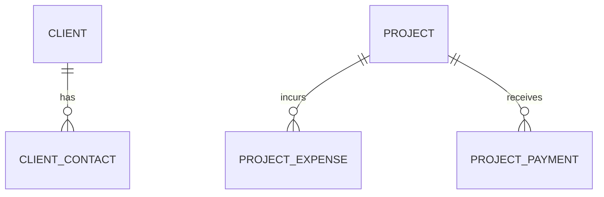

# Commercial module entities

The commercial domain: clients and their contacts, project expenses (cost), and project payments (revenue).

## Entities

| Entity | Notes |
|--------|-------|
| `Client` | a client organization |
| `ClientContact` | contact people belonging to a client |
| `ProjectExpense` | cost item charged against a project (feeds profitability/finance) |
| `ProjectPayment` | incoming payment against a project; the counterpart bank transactions get reconciled to |

## Diagram

`ProjectPayment` is reconciled with `BankTransaction` (see [finance module entities](/charter/modules/finance/module-entities.md)) during reconciliation — that is a service-level match, not an FK.

## Cross-references

- [Client module](/charter/modules/commercial/client-module.md), [Presale module](/charter/modules/commercial/presale-module.md), [Expense module](/charter/modules/commercial/expense-module.md), [Payment module](/charter/modules/commercial/payment-module.md) — the owning modules.
- [Finance module entities](/charter/modules/finance/module-entities.md) — `ProjectPayment` ↔ `BankTransaction` reconciliation.
- [Delivery module entities](/charter/modules/delivery/module-entities.md) — `Project` anchors expenses/payments; `ClientPayment` (phase-tied) is distinct from `ProjectPayment`.