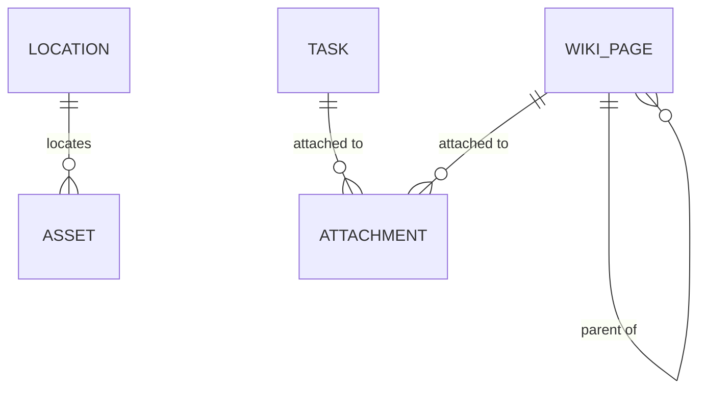

# Content module entities

Project content: the self-referencing wiki page tree, file attachments (polymorphic), and asset management with locations.

## Entities

| Entity | Notes |
|--------|-------|
| `WikiPage` | self-referencing (parent → children) entity forming a nested page tree; project-scoped |
| `Attachment` | file metadata (filename, path, contentType, size); bytes via `StorageService`; attachable to tasks and wiki pages |
| `Asset` | a physical or logical item |
| `Location` | a location assets may reference |

## Diagram

`Attachment` is polymorphic — it attaches to either a `Task` or a `WikiPage`.

## Cross-references

- [Documentation module](/charter/modules/content/documentation-module.md), [Attachment module](/charter/modules/content/attachment-module.md), [Asset module](/charter/modules/content/asset-module.md), [Location module](/charter/modules/content/location-module.md) — the owning modules.
- [File storage](/charter/implementation/cross-cutting/file-storage.md) — the pluggable storage abstraction behind `Attachment`.
- [Delivery module entities](/charter/modules/delivery/module-entities.md) — `Task` is an attachable target.