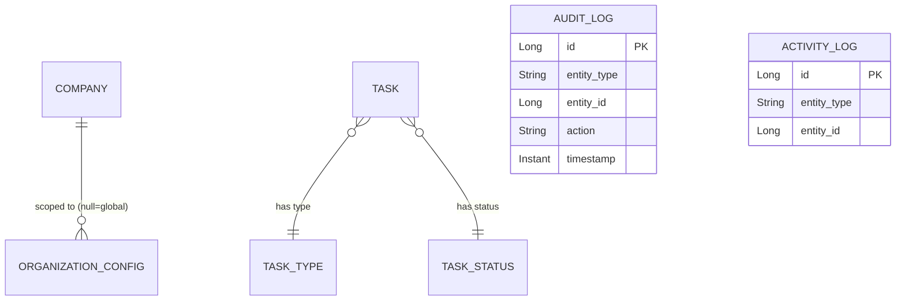

# Cross-cutting module entities

Configuration and shared infrastructure entities shared across all domain modules: organization config, the configurable task taxonomy, holidays, and the audit/activity logs.

## Entities

| Entity | Notes |
|--------|-------|
| `OrganizationConfig` | per-company configuration with a global fallback (`null` company_id) |
| `TaskType`, `TaskStatus` | configurable task taxonomy (seeded via `data.sql`) |
| `PublicHoliday` | holiday calendar |
| `AuditLog` (`common.audit`) | AOP-captured audit records via `AuditAspect` / `@Audited` (who, what action, which entity, previous value, timestamp) |
| `ActivityLog` (`common.activity`) | activity records via `ActivityInterceptor` |

## Diagram

`AuditLog` and `ActivityLog` reference entities generically by `entity_type` / `entity_id` rather than via typed FKs.

## Cross-references

- [Config module](/charter/modules/cross-cutting/config-module.md), [Common module](/charter/modules/cross-cutting/common-module.md) — the owning modules.
- [Audit logging](/charter/implementation/cross-cutting/audit-logging.md), [Activity tracking](/charter/implementation/cross-cutting/activity-tracking.md) — the mechanisms.
- [Delivery module entities](/charter/modules/delivery/module-entities.md) — `Task` consumes `TaskType`/`TaskStatus`.