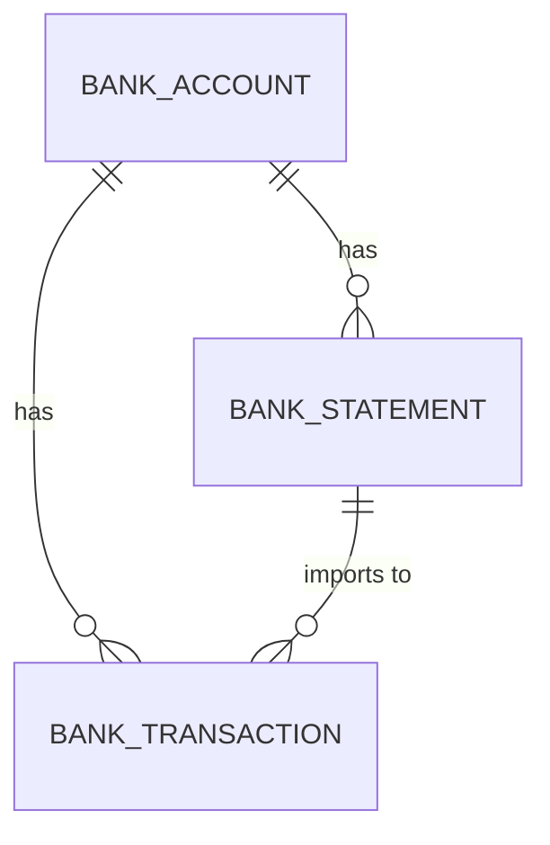

# Finance module entities

The banking domain: bank accounts (company-scoped) anchor statements and transactions; statements are PDF-imported; transactions are the side matched to project payments during reconciliation.

## Entities

| Entity | Notes |
|--------|-------|
| `BankAccount` | company-scoped bank account; anchor for statements and transactions |
| `BankStatement` | an imported statement; `StatementImportService` parses PDFs via Apache PDFBox |
| `BankTransaction` | individual movements on an account |

## Diagram

`Reconciliation` is a service/operation matching `BankTransaction` ↔ `ProjectPayment` (see [reconciliation module](/charter/modules/finance/reconciliation-module.md) and [commercial module entities](/charter/modules/commercial/module-entities.md)), not a standalone entity.

## Cross-references

- [Bank account module](/charter/modules/finance/bankaccount-module.md), [Bank statement module](/charter/modules/finance/bankstatement-module.md), [Bank transaction module](/charter/modules/finance/banktransaction-module.md), [Reconciliation module](/charter/modules/finance/reconciliation-module.md), [Finance module](/charter/modules/finance/finance-module.md) — the owning modules.
- [Commercial module entities](/charter/modules/commercial/module-entities.md) — `ProjectPayment`, the reconciliation counterpart.