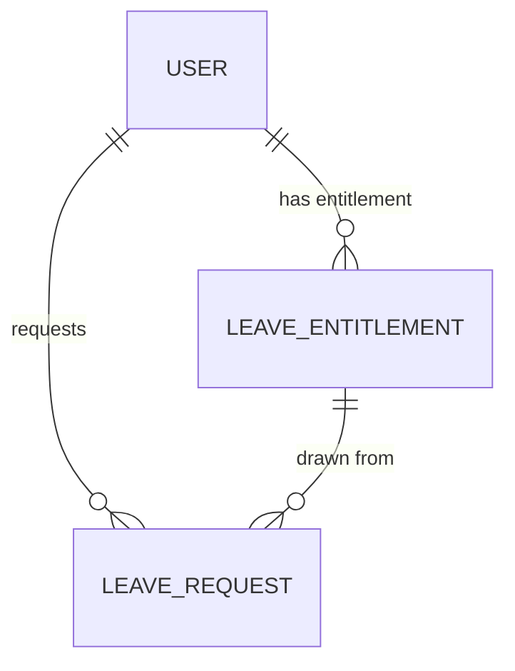

# HR module entities

The HR domain: time-off (leave requests, entitlements, balances) and the planned evaluation concept.

## Entities

| Entity | Notes |
|--------|-------|
| `LeaveRequest` | a time-off request belonging to a user |
| `LeaveEntitlement` | leave entitlement/balance per user |
| `Evaluation` | *planned / not yet implemented* — employee performance evaluations and review cycles (no `evaluation/` backend package yet) |

## Diagram

`Evaluation` is planned; it will relate to `User` (reviewer/reviewee) once implemented.

## Cross-references

- [Leave module](/charter/modules/hr/leave-module.md), [Evaluation module](/charter/modules/hr/evaluation-module.md) — the owning modules.
- [Identity module entities](/charter/modules/identity/module-entities.md) — `User` owns leave/entitlements.