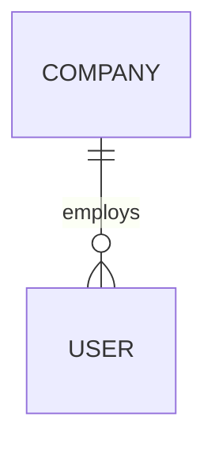

# Identity module entities

The tenant/identity core. `Company` is the tenant anchor; `User` belongs to a company (or is global when `company_id` is null).

## Entities

| Entity | Notes |
|--------|-------|
| `Company` | tenant anchor; a nullable `company_id` FK on many entities scopes them, `null` = global |
| `User` (table `app_user`) | username, email, passwordHash, `role` enum, company, assignedProject, jobTitle, department, hireDate, weeklyCapacity |

## Diagram

A `null` `company_id` on `User` denotes a global user visible across companies.

## Cross-references

- [Company module](/charter/modules/identity/company-module.md), [User module](/charter/modules/identity/user-module.md) — the owning modules.
- [Multi-tenancy](/charter/security/multi-tenancy.md) — the `company_id` scoping convention.
- [Cross-cutting module entities](/charter/modules/cross-cutting/module-entities.md) — `OrganizationConfig` is scoped per company.