# UML diagrams

Structural and behavioral diagrams for Nemo, compiled from the legacy `docs/uml-diagrams.md`. All diagrams use [Mermaid](https://mermaid.js.org/) syntax. Per-entity field tables and ER diagrams live as `module-entities.md` under each module group; this page holds the cross-module class diagram and the use-case/state/sequence/component views.

## 1. Domain model (class diagram)

Core entities and their relationships.

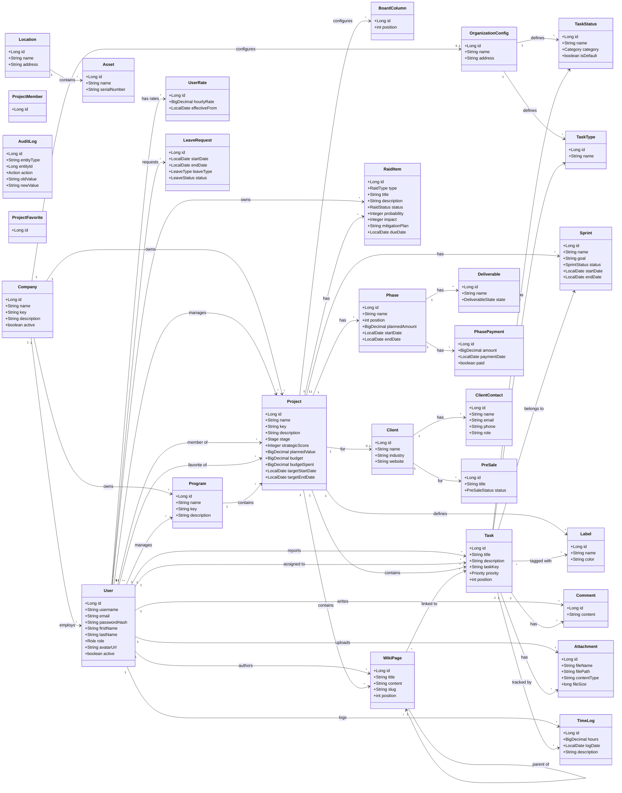

Field-level detail per group: [identity](/modules/identity/module-entities.md), [cross-cutting](/modules/cross-cutting/module-entities.md), [delivery](/modules/delivery/module-entities.md), [commercial](/modules/commercial/module-entities.md), [finance](/modules/finance/module-entities.md), [hr](/modules/hr/module-entities.md), [timetracking](/modules/timetracking/module-entities.md), [content](/modules/content/module-entities.md).

## 2. Use case diagrams

### 2.1 Admin

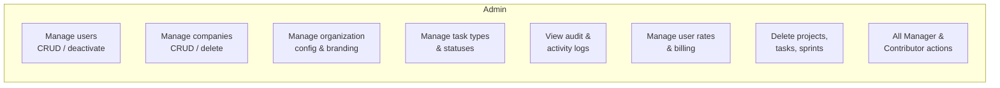

### 2.2 Manager

```mermaid
flowchart LR
    subgraph Manager
        direction TB
        M1[Create & edit projects]
        M2[Assign members<br/>to projects]
        M3[Create & edit tasks]
        M4[Manage sprints<br/>& backlog]
        M5[Configure Kanban<br/>board columns]
        M6[View team<br/>timesheets]
        M7[Manage wiki pages<br/>& notes]
        M8[Manage RAID items]
        M9[View PMO &<br/>portfolio data]
        M10[Manage phases,<br/>deliverables & payments]
        M11[Approve / reject<br/>leave requests]
        M12[Manage clients<br/>& contacts]
        M13[Manage pre-sales]
        M14[Manage programs]
        M15[Manage project<br/>instructions & labels]
        M16[Log time &<br/>edit own time logs]
        M17[Delete tasks &<br/>comments]
    end
```

### 2.3 Executive

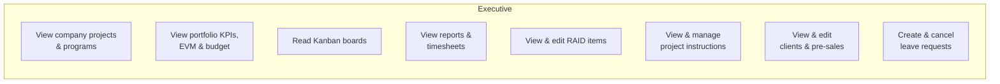

### 2.4 HR

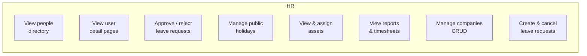

### 2.5 Contributor

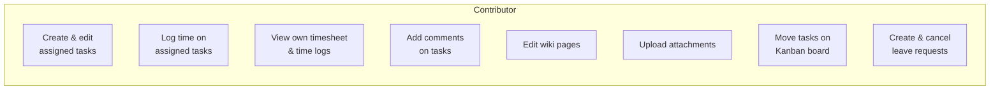

### 2.6 External user

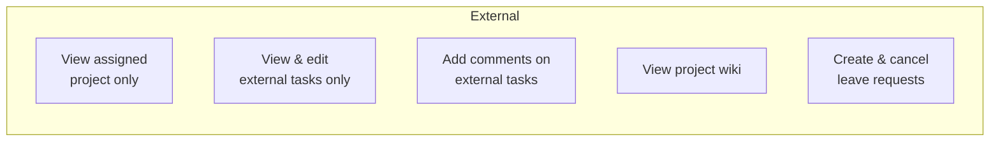

### 2.7 Common (all authenticated roles)

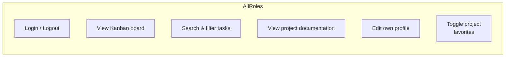

Role meanings and the full access matrix: [authorization (RBAC)](/security/authorization-rbac.md), [features and access](/security/features-and-access.md).

## 3. Task lifecycle (state diagram)

How a task moves through statuses.

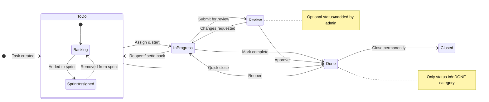

See the [task module](/modules/delivery/task-module.md).

## 4. Authentication flow (sequence diagram)

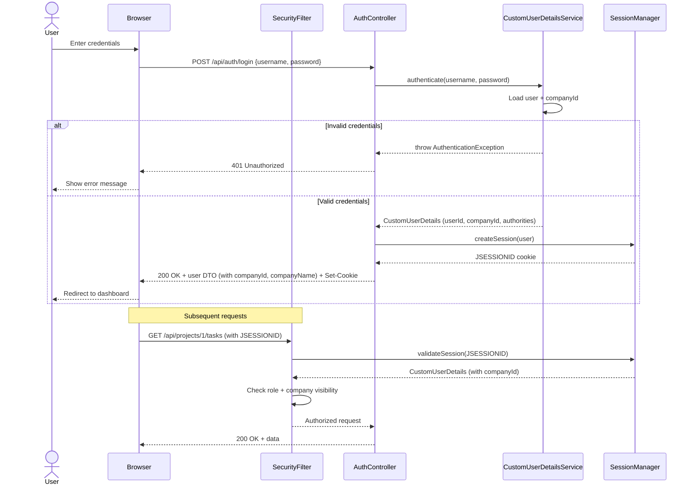

See [authentication](/security/authentication.md).

## 5. Kanban real-time update (sequence diagram)

How WebSocket keeps boards in sync across clients.

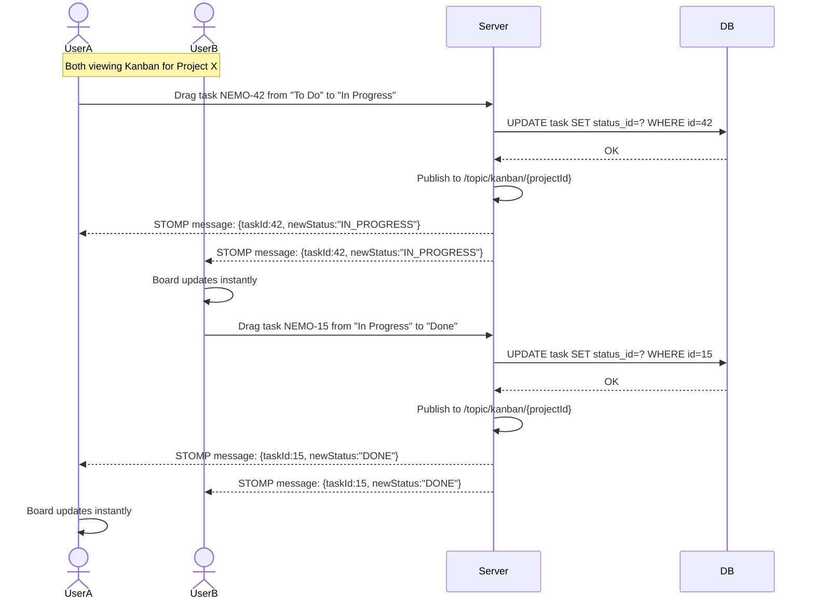

See [WebSockets](/implementation/cross-cutting/websockets.md).

## 6. Backend package structure (component diagram)

```mermaid
flowchart TB
    subgraph nemo-backend
        direction TB

        subgraph common
            STORAGE[StorageService<br/>FilesystemStorage]
            AUDIT[Audited<br/>annotation]
            EXC[GlobalExceptionHandler]
            DTO[DTOs & Mappers]
        end

        subgraph config
            SECURITY[SecurityConfig]
            WEBSOCKET[WebSocketConfig]
            CORS[CORS Config]
            SEEDER[DataSeeder]
            TASK_CFG[TaskConfigController<br/>TaskStatus / TaskType]
        end

        subgraph security
            AUTH_FILTER[AuthFilter]
            CUSTOM_DETAILS[CustomUserDetails]
            AUTH_HELPER[AuthHelper<br/>company visibility]
        end

        subgraph company
            CC[CompanyController]
            CS[CompanyService]
            CR[CompanyRepository]
        end

        subgraph user
            UC[UserController]
            US[UserService]
            UR[UserRepository]
        end

        subgraph program
            PC[ProgramController]
            PS[ProgramService]
            PR[ProgramRepository]
        end

        subgraph project
            PJC[ProjectController]
            PJS[ProjectService]
            PJR[ProjectRepository]
        end

        subgraph task
            TC[TaskController]
            TS[TaskService]
            TR[TaskRepository]
        end

        subgraph sprint
            SC[SprintController]
            SS[SprintService]
            SR[SprintRepository]
        end

        subgraph timetracking
            TLC[TimeLogController]
            TLS[TimeLogService]
            TLR[TimeLogRepository]
        end

        subgraph documentation
            WC[WikiPageController]
            WS[WikiPageService]
            WR[WikiPageRepository]
        end

        subgraph pmo
            RC[RaidItemController]
            RS[RaidItemService]
            RR[RaidItemRepository]
        end

        subgraph attachment
            AC[AttachmentController]
            AS[AttachmentService]
            AR[AttachmentRepository]
        end

        subgraph client
            CLC[ClientController]
            CLS[ClientService]
            CLR[ClientRepository]
        end

        subgraph presale
            PSC[PreSaleController]
            PSS[PreSaleService]
            PSR[PreSaleRepository]
        end

        subgraph phase
            PHC[PhaseController]
            PHS[PhaseService]
            PHR[PhaseRepository]
        end

        subgraph leave
            LC[LeaveRequestController]
            LS[LeaveRequestService]
            LR[LeaveRequestRepository]
        end

        subgraph asset
            ALC[AssetController]
            ALS[AssetService]
            ALR[AssetRepository]
            LOCLC[LocationController]
            LOCS[LocationService]
        end
    end

    STORAGE -.-> AS
    AUDIT -.-> TS
    AUDIT -.-> TLS
    EXC -.-> TC & TLC & WC
    AUTH_HELPER -.-> PJS & PS & US
```

See the [modules index](/modules/index.md) and [monorepo structure](/overview/monorepo-structure.md).

## 7. Time tracking flow (sequence diagram)

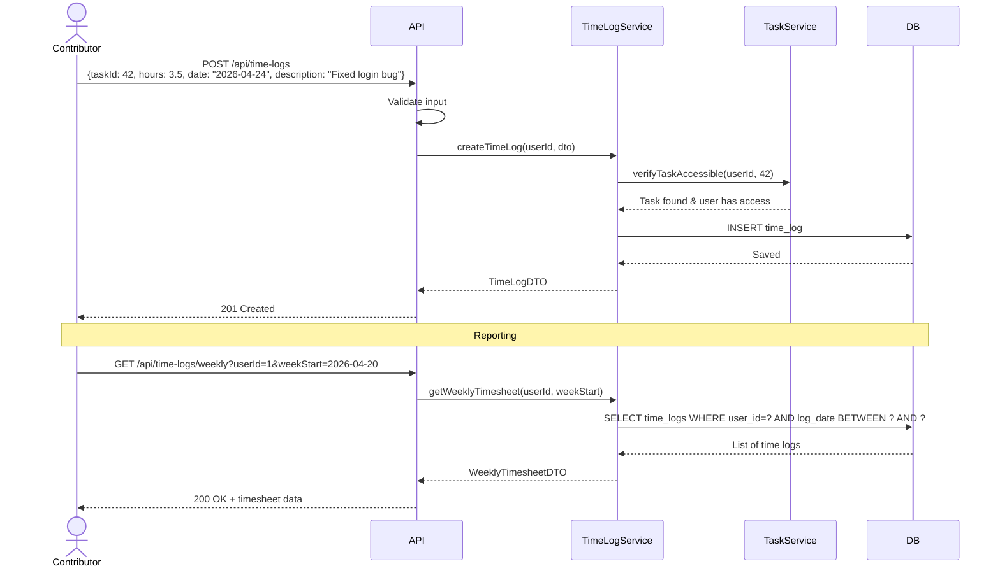

See the [time tracking module](/modules/timetracking/index.md).

## 8. Role-based access overview

Summary of which roles can access which modules.

```mermaid
flowchart TB
    subgraph Roles
        ADMIN[ADMIN]
        MANAGER[MANAGER]
        EXECUTIVE[EXECUTIVE]
        HR[HR]
        CONTRIBUTOR[CONTRIBUTOR]
        EXTERNAL[EXTERNAL]
    end

    subgraph Modules
        direction TB
        AUTH[Authentication]
        DASH[Dashboards]
        PROJ[Projects & Tasks]
        SPRINT[Sprints]
        PHASE[Phases & Payments]
        RAID[RAID Items]
        PMO[PMO / Portfolio]
        CLIENTS[Clients]
        PRESALE[Pre-Sales]
        PROGS[Programs]
        PEOPLE[People]
        TIME[Time Tracking]
        TSHEETS[Timesheets]
        REPORTS[Reports]
        LEAVE[Leave]
        HOLIDAYS[Holidays]
        ASSETS[Assets]
        WIKI[Wiki Pages]
        ADMIN_CFG[Admin Config]
    end

    ADMIN --> AUTH & DASH & PROJ & SPRINT & PHASE & RAID & PMO & CLIENTS & PRESALE & PROGS & PEOPLE & TIME & TSHEETS & REPORTS & LEAVE & HOLIDAYS & ASSETS & WIKI & ADMIN_CFG
    MANAGER --> AUTH & DASH & PROJ & SPRINT & PHASE & RAID & PMO & CLIENTS & PRESALE & PROGS & PEOPLE & TIME & TSHEETS & REPORTS & LEAVE & WIKI
    EXECUTIVE --> AUTH & DASH & PROJ & RAID & PMO & CLIENTS & PRESALE & TIME & REPORTS & LEAVE & WIKI
    HR --> AUTH & DASH & PROJ & PEOPLE & TSHEETS & REPORTS & LEAVE & HOLIDAYS & ASSETS & CLIENTS & PRESALE & WIKI
    CONTRIBUTOR --> AUTH & DASH & PROJ & TIME & LEAVE & WIKI
    EXTERNAL --> AUTH & DASH & PROJ & LEAVE & WIKI
```

See [features and access](/security/features-and-access.md) for the detailed matrix.

## Cross-references

- [System architecture](/implementation/architecture/system-architecture.md) — the integrated structural view these diagrams illustrate.
- [Database schema](/overview/database-schema.md) — schema overview and naming conventions.
- [Security index](/security/index.md) — authentication, RBAC, multi-tenancy.
- [Modules index](/modules/index.md) — the domain packages in the component diagram.