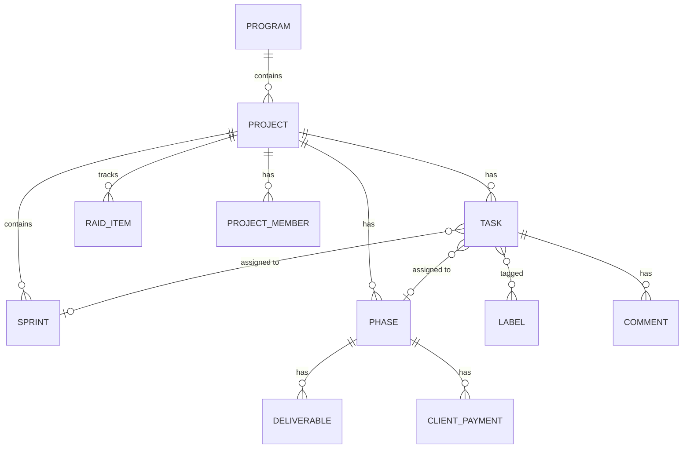

# Delivery module entities

The project-delivery domain: programs, projects (with membership, board, labels, notes), tasks (with comments), sprints, phases (with deliverables and client payments), and PMO RAID items.

## Entities

| Entity | Notes |
|--------|-------|
| `Program` | groups projects |
| `Project` | company-scoped core unit; `null` company_id = global |
| `ProjectMember`, `ProjectFavorite`, `Label`, `BoardColumn`, `ProjectNote`, `ProjectInstruction`, `ProjectActivity` | project sub-entities |
| `Task` (table `task`) | title, description, `taskKey` (unique), status→`TaskStatus`, type→`TaskType`, project, assignee, reporter, sprint, phase, position, external flag, labels M:N, `Priority` enum |
| `Comment` | task comments |
| `Sprint` | sprint container within a project |
| `Phase`, `Deliverable`, `ClientPayment` | phase-level planning and client billing |
| `RaidItem` | PMO risks/assumptions/issues/dependencies (custom `RiskScaleDeserializer`) |

## Diagram

## Cross-references

- [Program module](/modules/delivery/program-module.md), [Project module](/modules/delivery/project-module.md), [Task module](/modules/delivery/task-module.md), [Sprint module](/modules/delivery/sprint-module.md), [Phase module](/modules/delivery/phase-module.md), [PMO module](/modules/delivery/pmo-module.md) — the owning modules.
- [Cross-cutting module entities](/modules/cross-cutting/module-entities.md) — `TaskType`/`TaskStatus` taxonomy.
- [Commercial module entities](/modules/commercial/module-entities.md) — `ClientPayment` (phase-tied) vs `ProjectPayment` (commercial).