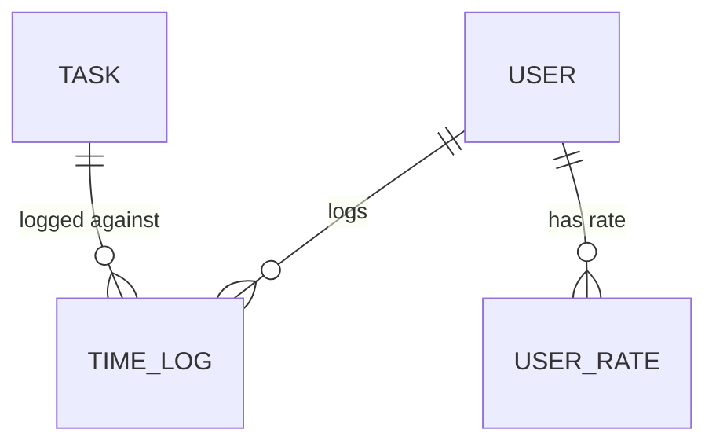

# Time tracking module entities

Effort captured as time logs and valued via user rates; timesheets are a derived roll-up of time logs.

## Entities

| Entity | Notes |
|--------|-------|
| `TimeLog` | logged effort against a task (audited — see [audit logging](/implementation/cross-cutting/audit-logging.md)) |
| `UserRate` | billable/cost rate per user, used to value time logs |
| `Timesheet` | rolled-up weekly/per-user view, derived from `TimeLog` (not a typed FK relationship) |

## Diagram

`Timesheet` aggregates `TimeLog` rows at query time rather than storing a separate relationship.

## Cross-references

- [Time log](/modules/timetracking/time-log.md), [Timesheet](/modules/timetracking/timesheet.md), [User rate](/modules/timetracking/user-rate.md), [Time report](/modules/timetracking/time-report.md) — the submodules.
- [Identity module entities](/modules/identity/module-entities.md) — `User` owns time logs and rates.
- [Delivery module entities](/modules/delivery/module-entities.md) — `Task` is the target of a time log.